## Лабораторная работа 1

### Задание 1
```python
name, age = input(), int(input()) + 1
print(f'Привет, {name}! Через год тебе будет {age}.')
```
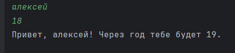

### Задание 2
```python
a = float(input().replace(',', '.'))
b = float(input().replace(',', '.'))
print(f'a: {a:.2f}')
print(f'b: {b:.2f}')
print(f'sum={a + b:.2f}; avg={(a + b)/ 2:.2f}')
```
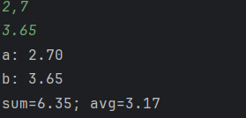

### Задание 3
```python
pri = int(input())
dis = int(input())
vat = int(input())
print(f'База после скидки: {pri * (1 - dis/100):.2f} ₽')
print(f'НДС:               {pri * (1 - dis / 100) * vat / 100:.2f} ₽')
print(f'Итого к оплате:    {pri * (1 - dis / 100) * (1 + vat / 100):.2f} ₽')
```
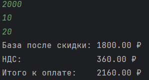

### Задание 4
```python
a = int(input())
print(f'Минуты: {a}')
print(f'{a//60}:{a % 60}')
```
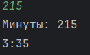

### Задание 5
```python
a, b, c = input().split()
print(f'ФИО: {a} {b} {c}')
print(f'Инициалы: {a[0]}{b[0]}{c[0]}')
print(len(a) + 2 + len(b) + len(c))
```
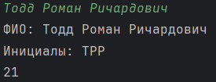

### Задание 6
```python
a, b = 0, 0
for i in range(int(input())):
    k = input().split()[-1]
    if k == 'True': a += 1
    else: b += 1
print(a, b)
```
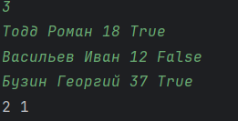

### Задание 7
```python
s, a, k, e, abc, p = input(), '0987654321', '', 0, 'ASDFGHJKLQWERTYUIOPZXCVBNM', 's'
for i in s:
    if i not in a:
        if i in abc:
            k += i
            ns = s[s.index(i) + 1:]
            break
for n in range(len(ns)):
    i = ns[n]
    if p in a:
        k += i
        e = n
        nks = ns[n + 1:]
        break
    p = i
t = len(nks)
while t > e:
    k += nks[e]
    nks = nks[e + 1:]
    t -= (e + 1)
print(k)
```
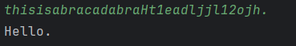


## Лабораторная работа 2

### Задание A1
```python
def min_max(matrix):
    if not matrix: return 'ValueError'
    new_list = []
    for i in matrix:
        new_list.append(i)
    return (min(new_list), max(new_list))
```
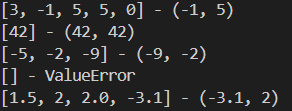

### Задание A2
```python
def unique_sorted(matrix):
    if not matrix: return 'ValueError'
    new_list = sorted(list(set(matrix)))
    return new_list
```
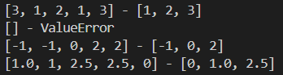

### Задание A3
```python
def flatten(matrix):
    new_list = []
    for i in matrix:
        if type(i) != list:
            if type(i) == tuple: new_list += list(i)
            else: return 'ValueError'
        else: new_list += i
    return new_list
```
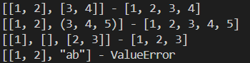


### Задание B1
```python
def check(matrix):
    if not matrix: return True
    k = len(matrix[0])
    for i in matrix:
        if len(i) != k: return False
    return True


def transpose(matrix: list[list[float | int]]) -> list[list]:
    if not check(matrix): return 'ValueError'
    if not matrix: return []
    new_list = []
    for i in range(len(matrix[0])):
        new_list.append([])
    for i in matrix:
        n = 0
        for j in i:
            new_list[n].append(j)
            n += 1
    return new_list
```
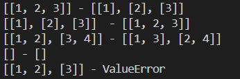

### Задание B2
```python
def check(matrix):
    if not matrix: return True
    k = len(matrix[0])
    for i in matrix:
        if len(i) != k: return False
    return True


def row_sums(matrix: list[list[float | int]]) -> list[float]:
    if not check(matrix): return 'ValueError'
    if not matrix: return 'ValueError'
    new_list = []
    for i in matrix:
        new_list.append(sum(i))
    return new_list
```
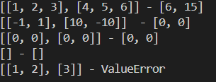

### Задание B3
```python
def check(matrix):
    if not matrix: return True
    k = len(matrix[0])
    for i in matrix:
        if len(i) != k: return False
    return True


def col_sums(matrix: list[list[float | int]]) -> list[float]:
    if not check(matrix): return 'ValueError'
    if not matrix: return 'ValueError'
    new_list1 = []
    if type(matrix[0]) != list: return matrix
    for i in range(len(matrix[0])):
        new_list1.append([])
    for i in matrix:
        for k in range(len(i)):
            new_list1[k].append(i[k])
            new_list = []
    for i in new_list1:
        new_list.append(sum(i))
    return new_list
```
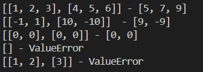

### Задание C
```python
def col_sums(matrix: list[list[float | int]]) -> list[float]:
    if not check(matrix): return 'ValueError'
    if not matrix: return 'ValueError'
    new_list1 = []
    if type(matrix[0]) != list: return matrix
    for i in range(len(matrix[0])):
        new_list1.append([])
    for i in matrix:
        for k in range(len(i)):
            new_list1[k].append(i[k])
            new_list = []
    for i in new_list1:
        new_list.append(sum(i))
    return new_list
```
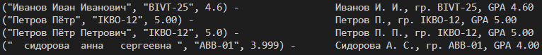