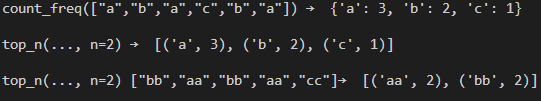
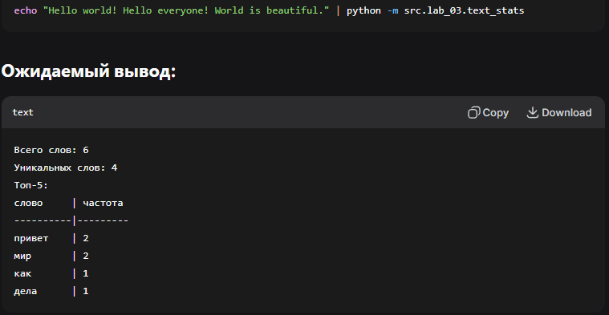

## Лабораторная работа 1

### Задание 1
```python
name, age = input(), int(input()) + 1
print(f'Привет, {name}! Через год тебе будет {age}.')
```


### Задание 2
```python
a = float(input().replace(',', '.'))
b = float(input().replace(',', '.'))
print(f'a: {a:.2f}')
print(f'b: {b:.2f}')
print(f'sum={a + b:.2f}; avg={(a + b)/ 2:.2f}')
```


### Задание 3
```python
pri = int(input())
dis = int(input())
vat = int(input())
print(f'База после скидки: {pri * (1 - dis/100):.2f} ₽')
print(f'НДС:               {pri * (1 - dis / 100) * vat / 100:.2f} ₽')
print(f'Итого к оплате:    {pri * (1 - dis / 100) * (1 + vat / 100):.2f} ₽')
```


### Задание 4
```python
a = int(input())
print(f'Минуты: {a}')
print(f'{a//60}:{a % 60}')
```


### Задание 5
```python
a, b, c = input().split()
print(f'ФИО: {a} {b} {c}')
print(f'Инициалы: {a[0]}{b[0]}{c[0]}')
print(len(a) + 2 + len(b) + len(c))
```


### Задание 6
```python
a, b = 0, 0
for i in range(int(input())):
    k = input().split()[-1]
    if k == 'True': a += 1
    else: b += 1
print(a, b)
```


### Задание 7
```python
s, a, k, e, abc, p = input(), '0987654321', '', 0, 'ASDFGHJKLQWERTYUIOPZXCVBNM', 's'
for i in s:
    if i not in a:
        if i in abc:
            k += i
            ns = s[s.index(i) + 1:]
            break
for n in range(len(ns)):
    i = ns[n]
    if p in a:
        k += i
        e = n
        nks = ns[n + 1:]
        break
    p = i
t = len(nks)
while t > e:
    k += nks[e]
    nks = nks[e + 1:]
    t -= (e + 1)
print(k)
```


## Лабораторная работа 2

### Задание A1
```python
def min_max(matrix):
    if not matrix: return 'ValueError'
    return (min(matrix), max(matrix))
```


### Задание A2
```python
def unique_sorted(matrix):
    if not matrix: return 'ValueError'
    return sorted(list(set(matrix)))
```


### Задание A3
```python
def flatten(matrix):
    new_list = []
    for i in matrix:
        if type(i) != list:
            if type(i) == tuple: new_list += list(i)
            else: return 'ValueError'
        else: new_list += i
    return new_list
```


### Задание B1
```python
def check(matrix):
    if not matrix: return True
    k = len(matrix[0])
    for i in matrix:
        if len(i) != k: return False
    return True


def transpose(matrix: list[list[float | int]]) -> list[list]:
    if not check(matrix): return 'ValueError'
    if not matrix: return []
    new_list = []
    new_list = [[]for i in range(len(matrix[0]))]
    for i in matrix:
        n = 0
        for j in i:
            new_list[n].append(j)
            n += 1
    return new_list
```


### Задание B2
```python
def check(matrix):
    if not matrix: return True
    k = len(matrix[0])
    for i in matrix:
        if len(i) != k: return False
    return True


def row_sums(matrix: list[list[float | int]]) -> list[float]:
    if not check(matrix): return 'ValueError'
    if not matrix: return 'ValueError'
    new_list = []
    for i in matrix:
        new_list.append(sum(i))
    return new_list
```


### Задание B3
```python
def check(matrix):
    if not matrix: return True
    k = len(matrix[0])
    for i in matrix:
        if len(i) != k: return False
    return True


def col_sums(matrix: list[list[float | int]]) -> list[float]:
    if not check(matrix): return 'ValueError'
    if not matrix: return 'ValueError'
    return row_sums(transpose(matrix))
```


### Задание C
```python
def format_record(rec: tuple[str, str, float]) -> str:
    group, gpa = rec[1], rec[2]
    name = rec[0].split()
    fio = name[0].capitalize() + ' ' + name[1][0].upper() + '.'
    if len(name) == 3:
        fio += ' '
        fio += name[-1][0].upper() + '.'
    return f'{fio}, гр. {group}, GPA {gpa:.2f}'
```


## Лабораторная работа 3

### Задача Normalize
```python
def normalize(text: str, *, casefold: bool = True, yo2e: bool = True) -> str:
    if casefold:
        text = text.casefold()
    if yo2e:
        text = text.replace("ё", "е").replace("Ё", "Е")
    if '\t' in text or '\r' in text or '\n' in text:
        text = text.replace("\t", " ").replace("\r", " ").replace("\n", " ")
    while "  " in text:
        text = text.replace(" " * 2, " ")
    return text.strip()
```


### Задача Tokenize
```python
def tokenize(text: str) -> list[str]:
    return [i.group() for i in finditer(pattern=r"\w+(?:-\w+)*", string=text)]
```


### Задача Count_freq + top_n
```python
def count_freq(tokens: list[str]) -> dict[str, int]:
    co = {}
    for i in tokens:
        if i in co: co[i] += 1
        else:  co[i] = 1
    return co


def top_n(freq: dict[str, int], n: int = 5) -> list[tuple[str, int]]:
    freq = sorted(freq.items(), key=lambda item: [-item[1], item[0]])
    top_n = []
    for i in range(min(n, len(freq))):
        top_n.append((freq[i][0], freq[i][1]))
    return top_n
```


### Задача text_stats
```python
from src.lib.text import count_freq, top_n, normalize, tokenize


def table(title: str, description: str, top: list[tuple[str, int]]) -> None:
    max_word_length = max([len(i[0]) for i in top]) + 1

    print(f"{title}{(max_word_length - 5) * ' '}| {description}")
    print("-" * (max_word_length + 2 + max_word_length))
    for i in top:
        word, count = i
        print(f"{word}{(max_word_length - len(word)) * ' '}| {count}")


def print_summary(text: str, is_table: bool, n: int = 5) -> None:
    tokens = tokenize(text=normalize(text=text))
    top = top_n(count_freq(tokens), n=n)

    print(f"Всего слов: {len(tokens)}")
    print(f"Уникальных слов: {len(set(tokens))}")

    print("Топ-5:")

    if is_table:
        table(title="cлoво", description="частота", top=top)
    else:
        for i, j in top:
            print(f"{i}:{j}")


```

```python
import sys
from ..lib.text import normalize
from src.lib.table import print_summary


def main():
    """
     IS_TABLE = True
     print_summary(text=sys.stdin.read(), is_table=IS_TABLE)

if __name__ == "__main__":
    main()
```
